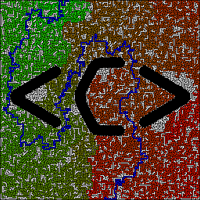

# Solving mazes
After having finished Stanford's "Algorithms" MOOC on Coursera, I was surfing the web and found Mike Pound's [video](https://www.youtube.com/watch?v=rop0W4QDOUI) on maze solving on Computerphile's Youtube channel. It seemed like a fun project to practice what I had just learned so I ended up writing up my own code for it.

I took all of the images from Mike's repository but I've rewritten all the path finding algorithms and drawing scripts from scratch, using my own code I wrote for my algorithms course. I also added a few heuristics to the Depth First Search algorithm, and a nice feature to visualize maze depth using Dijkstra, it givess you a rough idea about how deep dead-ends go in a maze. Here's an example:

I ran out of RAM (I only have 8GB) for the larger images and was stuck with just drawing the solution using depth first search, because it's the most light weight.
